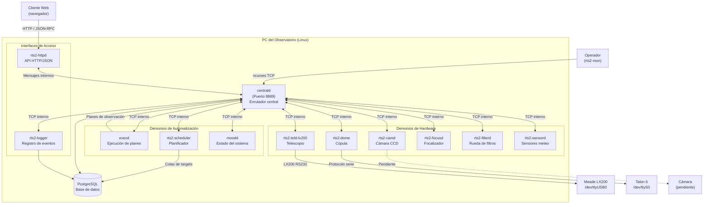
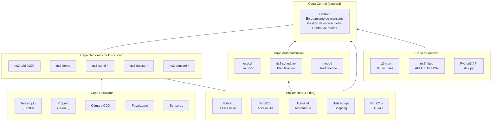
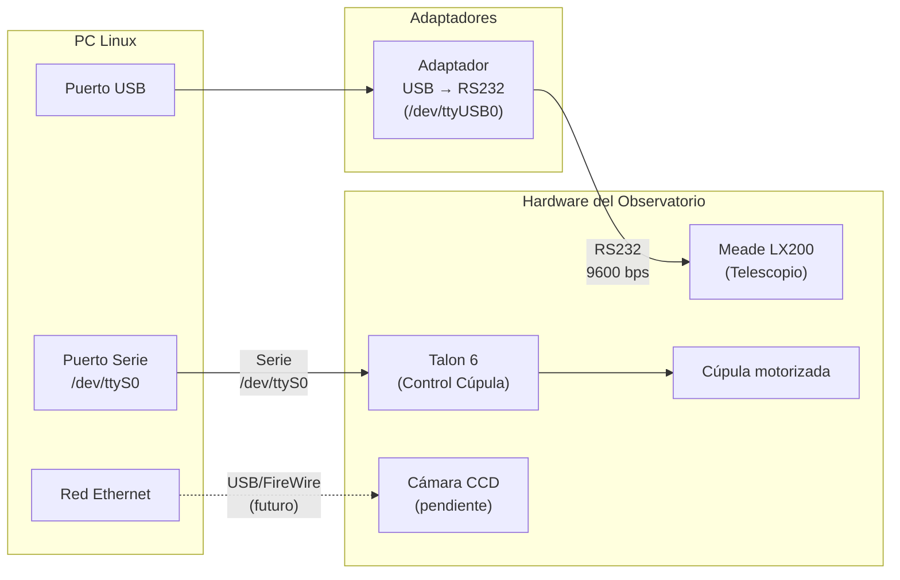
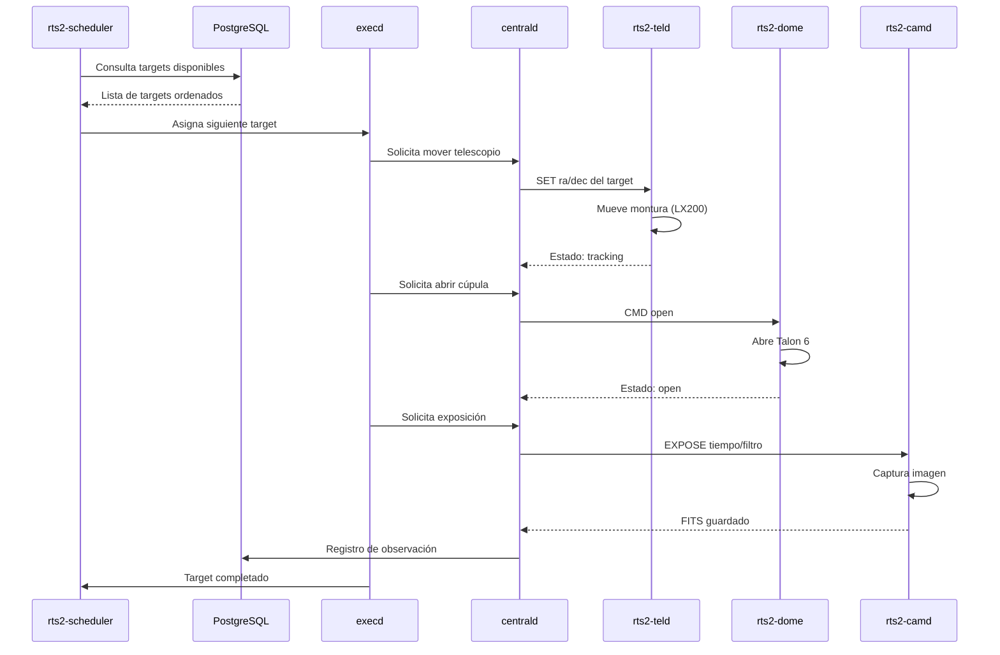
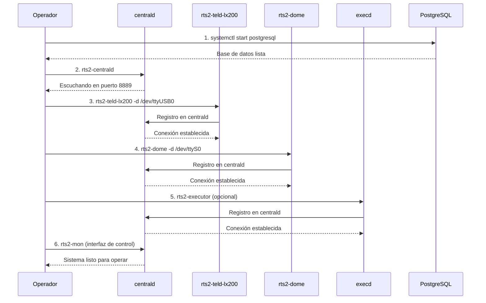
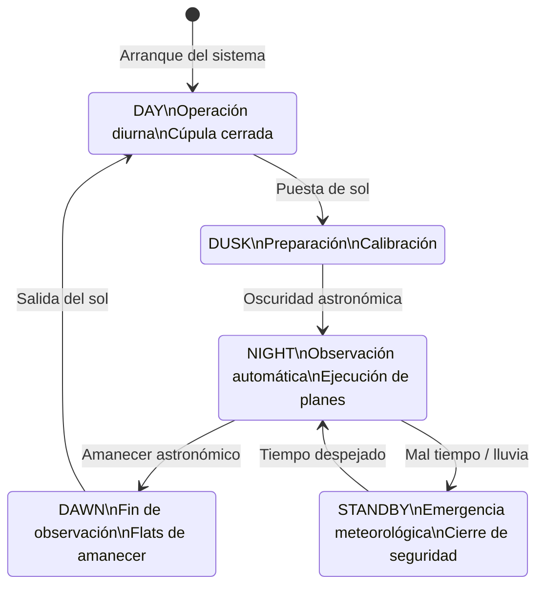

# Arquitectura del Sistema RTS2 — Observatorio ETSIINF (UPM)

Este documento describe visualmente la arquitectura completa del sistema RTS2 y las conexiones físicas con el hardware del observatorio.

---

## 1. Arquitectura General de Demonios

Todos los módulos de RTS2 son procesos independientes que se comunican entre sí a través del **demonio central** (`centrald`), que actúa como enrutador de mensajes en el puerto 8889.

---

## 2. Capas de Software (Arquitectura en Capas)

---

## 3. Conexiones Físicas del Hardware

---

## 4. Flujo de una Observación Automática

---

## 5. Secuencia de Arranque del Sistema

El orden en que deben arrancarse los demonios es estricto: primero el enrutador, luego los dispositivos.

---

## 6. Modos de Operación del Sistema

`moodd` controla el estado global que regula qué acciones están permitidas.

---

## 7. Estado Actual del Hardware

| Componente | Modelo | Puerto (Windows) | Puerto (Linux) | Estado |
|---|---|---|---|---|
| Telescopio | Meade LX200 | `COM3` | `/dev/ttyUSB0` | Conectado |
| Cúpula | Talon 6 | `COM1` | `/dev/ttyS0` | Conectado |
| Cámara | Por determinar | — | — | Pendiente de instalación |
| Focalizador | Por determinar | — | — | Pendiente |
| Sensor meteo | Por determinar | — | — | Pendiente |
